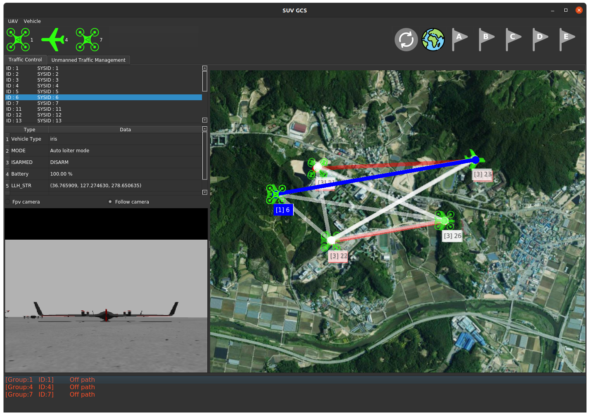
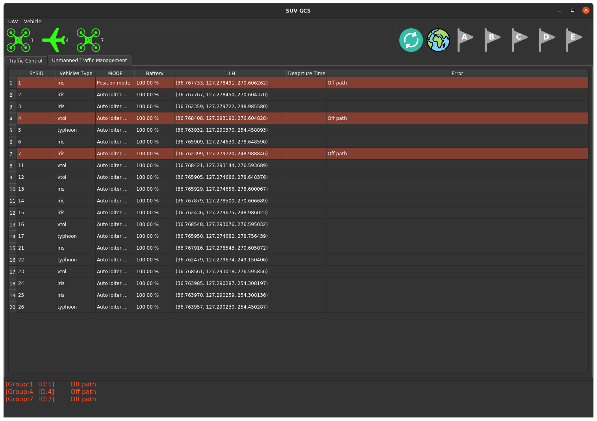

# SUV-GCS

## Build
#### 빌드 전
- [SUV-Tools 빌드](https://github.com/SUV-Olympiad/SUV-Tools/blob/main/ros2/README.md)  
- `source ros2/install/setup.bash` 

### build/ 생성 후 안에서 진행

- `cmake ..`
- `make`

## Run

- build/ 
- `./suvgcs`


# GCS 사용법

## Config file

##### 실행 전 어떤 기체들에 대해 관제를 할 것인지 정의
##### 왼쪽 상단 "UAV - Import from configfile" 에서 configfile 선택
- `docs/`에 정의
- agent의 `sysid`, `mode`, `type`, `group`, `vehicle` 정의
- `group` : 그룹 종류
- `vehicle` : 기체의 종류 [ iris, typhoon, vtol ]
- 원하는 개수의 기체 정보 입 
#### format
```conf
<agent id = "1">
    <sysid> 1 </sysid>
    <mode> real </mode>
    <type>CMODEL</type>   
    <group>1</group>
    <vehicle>iris</vehicle>
</agent>
```

## TrafficControl



#### 1. 왼쪽의 표에서 원하는 기체 선택시 `vehicle Type`, `Mode`, `Arm` 상태, `Battery`, `LLH` 위치 확인
#### 2. 왼쪽 하단 fpv camera, follow camera 영상 확인
#### 3. 우측 지도에서 "[group number]sysid" 형태로 어떤 기체인지 표시
#### 4. 경로 표시
#### 5.  : A, B, C, D, E 각 VeriPort 화면
#### 6.  : 지도화면으로 전환
#### 7.  : UTM Algorithm 버튼


## Unmanned Traffic management



#### 1. 여러 기체의 정보를 한 눈에 파악 가능
#### 2. 경로 이탈 등 문제 발생 기체 경고 기능
